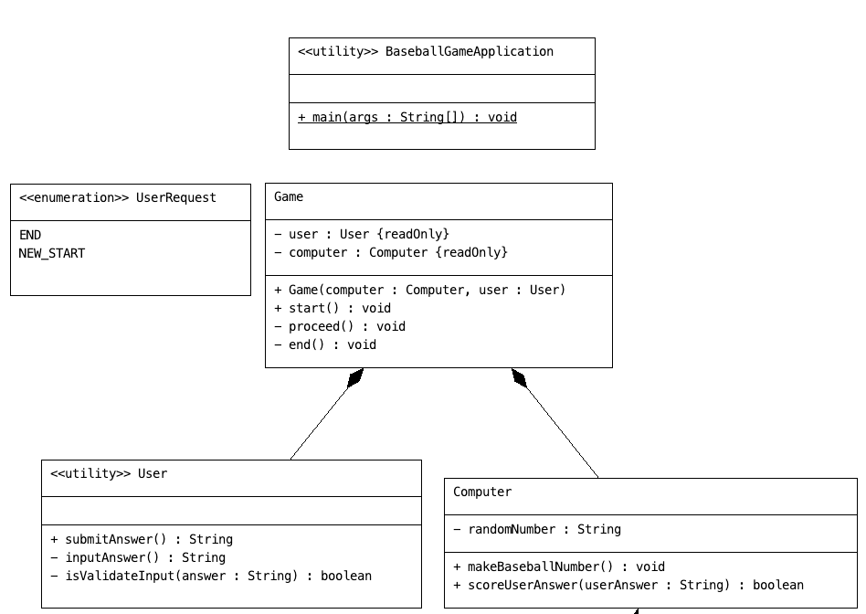
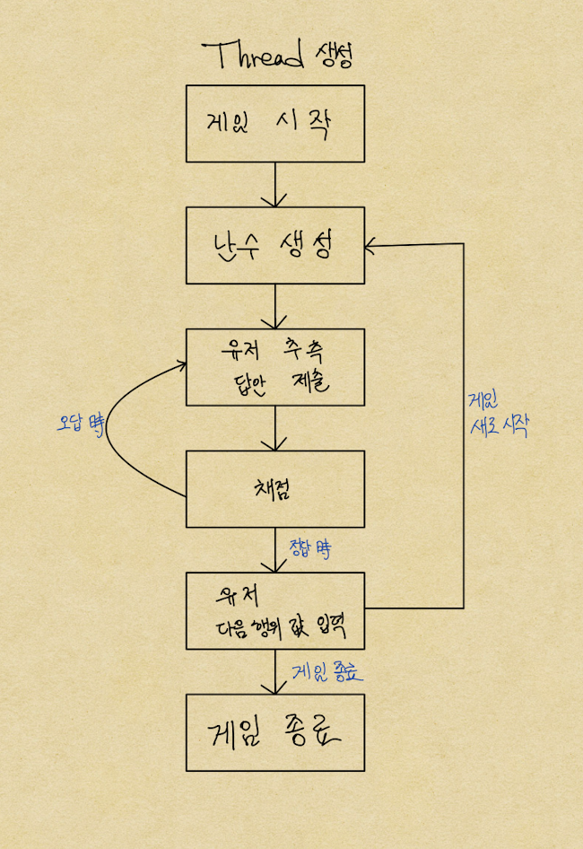

# 숫자 야구 게임

## 진행 방법

* 숫자 야구 게임 요구사항을 파악한다.
* 요구사항에 대한 구현을 완료한 후 자신의 github 아이디에 해당하는 브랜치에 Pull Request(이하 PR)를 통해 과제를 제출한다.

## 과제 제출 과정

* [과제 제출 방법](https://github.com/next-step/nextstep-docs/tree/master/precourse)

## 핵심 기능 목록

1. Game  

- [ ] 게임을 시작한다  
- [ ] 게임을 진행한다  
- [ ] 게임을 종료한다  

2. 유저  

- [ ] 답안을 입력한다  
- [X] 입력한 값에 대한 유효성을 체크한다  
   + `3자리` && `숫자`만 입력 가능하다
- [ ] 답안을 제출한다  
- [ ] 게임을 더할지, 말지 결정한다  

3. 컴퓨터  

- [ ] 서로 다른 세자리 난수를 생성한다
- [ ] 사용자가 제출한 답안에 대해 채점한다.

## 흐름 & UML

