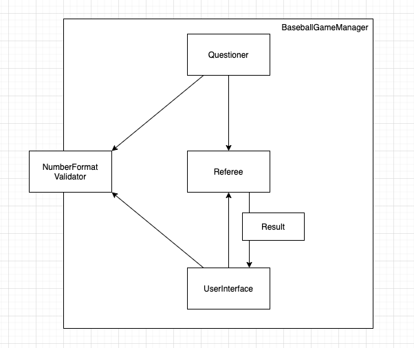

# 숫자 야구 게임
## 진행 방법
* 숫자 야구 게임 요구사항을 파악한다.
* 요구사항에 대한 구현을 완료한 후 자신의 github 아이디에 해당하는 브랜치에 Pull Request(이하 PR)를 통해 과제를 제출한다.

## 구현해야 할 클래스 목록

1. 게임을 실행, 종료하는 책임을 가진 클래스 (`BaseballGameManager`)
2. 문제를 출제하는 클래스 (`Questioner`)
    - 문제는 숫자라는 별도의 타입을 갖는다.
    - 문제는 숫자 3자리를 낸다.
    - 출제가 완료되면 채점자에게 전달한다.
3. player 와 상호작용 하는 User Interface (`UserInterface`)
    - 콘솔에서 입력을 받는다.
    - 채점 결과를 알려준다.
4. 채점을 수행하는 심판 클래스 (`Referee`)
    - 출제자에게 문제를 전달받는다.
    - player 에게 답안을 전달받는다.
    - 문제와 답안을 검토하여 strike, ball 등을 채점한다.
    - UI로 결과를 전송해준다.
5. 채점 결과 enum (`Result`)
    - strike, ball 등을 명시한다
6. validator (`NumberFormatValidator`)
    - 컴퓨터가 생성하는 숫자와 사용자가 입력 하는 숫자의 규칙이 동일하여 모듈로 분리한다

## Story

1. 게임이 시작된다.
2. `Questioner` 는 문제를 출제한다.
3. 사용자는 `UserInterface` 를 통해 정답을 제출한다.
4. 심판 `Referee` 는 문제와 정답을 받아 채점한다.
5. 심판이 `UserInterface` 로 채점 결과를 전송한다.
6. `UserInterface` 는 사용자가 읽을 수 있는 한글 메세지로 변경한다.
7. 채점 결과에 따라 정답을 다시 받거나, 3 strike 를 득점한 경우 게임 재시작 여부를 묻는다.

## 주의

1. [코딩 컨벤션](https://naver.github.io/hackday-conventions-java )을 지킨다.
2. indent 의 depth 는 1까지만 허용한다
3. stream 은 사용할 수 없다.
4. else 는 사용할 수 없다.
5. 함수는 10 라인을 넘어가지 않도록 구현한다.
6. [커밋 메세지 컨벤션](https://gist.github.com/stephenparish/9941e89d80e2bc58a153) 으로 git 커밋 메세지를 작성한다.

## 과제 제출 과정
* [과제 제출 방법](https://github.com/next-step/nextstep-docs/tree/master/precourse)
