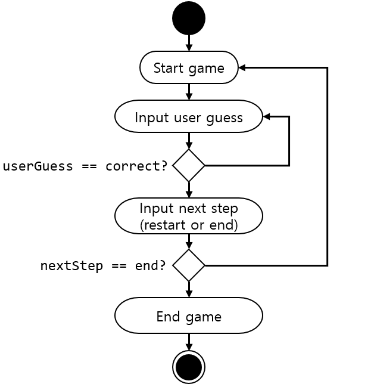

# 숫자 야구 게임

## 기능 요구사항
* 기본적으로 1부터 9까지 서로 다른 수로 이루어진 3자리의 수를 맞추는 게임이다.
* 같은 수가 같은 자리에 있으면 스트라이크, 다른 자리에 있으면 볼, 같은 수가 전혀 없으면 포볼 또는 낫싱이란 힌트를 얻고, 그 힌트를 이용해서 먼저 상대방(컴퓨터)의 수를 맞추면 승리한다.
  * [예] 상대방(컴퓨터)의 수가 425일 때, 123을 제시한 경우 : 1 스트라이크, 456을 제시한 경우 : 1 스트라이크 1볼, 789를 제시한 경우 : 낫싱
* 위 숫자 야구게임에서 상대방의 역할을 컴퓨터가 한다. 컴퓨터는 1에서 9까지 서로 다른 임의의 수 3개를 선택한다. 게임 플레이어는 컴퓨터가 생각하고 있는 3개의 숫자를 입력하고, 컴퓨터는 입력한 숫자에 대한 결과를 출력한다.
* 이 같은 과정을 반복해 컴퓨터가 선택한 3개의 숫자를 모두 맞히면 게임이 종료된다.
* 게임을 종료한 후 게임을 다시 시작하거나 완전히 종료할 수 있다.

## 디자인
MVC Pattern

* View
  * User I/O는 console을 통해 처리한다.
* Model
  * BaseballGameService
    * 게임 시작 시, 1부터 9까지 서로 다른 수 3자리 수를 임의로 생성한다.
    * 1부터 9까지의 숫자 3개를 받고, 스트라이크 수와 볼 수를 리턴한다.
* Controller
  * User input을 받아 게임을 진행하고, 게임 종료 시 재시작 여부를 확인한다.
  * Controller Activity Diagram 
    * 

## 구현할 기능 목록
* MVC-model Skeleton code build-up
  * MVC 구조 생성
  * Model의 BaseballGameService skeleton 구현
  * View의 Interface 구현
* Controller의 activity logic 구현
* Console로 user I/O를 처리할 수 있도록 Console I/O 구현 및 테스트
* BaseballGameService
  * 임의의 3자리 수 만들기 구현 및 테스트
  * User input에 대해 스트라이크 수 와 볼 수를 계산하는 로직 구현 및 테스트
