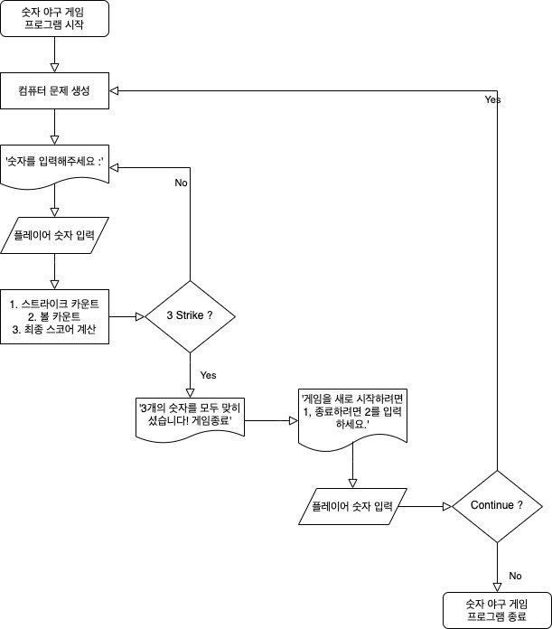

# 숫자 야구 게임
## 진행 방법
* 숫자 야구 게임 요구사항을 파악한다.
* 요구사항에 대한 구현을 완료한 후 자신의 github 아이디에 해당하는 브랜치에 Pull Request(이하 PR)를 통해 과제를 제출한다.

## 과제 제출 과정
* [과제 제출 방법](https://github.com/next-step/nextstep-docs/tree/master/precourse)

## 1. 요구사항 정의
### 1.1. 과제 진행 요구사항
|상세|구현 방법|비고|
|:---|---|---|
|•미션은 https://github.com/next-step/java-baseball-precourse 저장소를 fork/clone해 시작한다.|[x] fork <br> [x] clone||
|•기능을 구현하기 전에 java-baseball/README.md 파일에 구현할 기능 목록을 정리해 추가한다. |[x] 요구사항 정리||
|•git의 commit 단위는 앞 단계에서 README.md 파일에 정리한 기능 목록 단위로 추가한다.<br>&nbsp;&nbsp;&nbsp;&nbsp;•AngularJS Commit Message Conventions 참고해 commit log를 남긴다.|[x] AngularJS Commit<br>&nbsp;&nbsp;&nbsp;&nbsp;Message Conventions 참고||
|•과제 진행 및 제출 방법은 프리코스 과제 제출 문서를 참고한다.|[ ] 과제 제출 문서 참고<br>[ ] 과제 제출|•2021년<br>&nbsp;4월 27일(화)<br>&nbsp;23시 59분까지 <br>&nbsp;GitHub을 통한<br>&nbsp;**미션 제출**과 **메일** 완료|

### 1.2. 프로그래밍 요구사항
|구분|상세|구현 방법|비고|
|:---:|:---|---|---|
|메소드 분리|• 자바 코드 컨벤션을 지키면서 프로그래밍한다.<br>&nbsp;&nbsp;• https://naver.github.io/hackday-conventions-java/|[ ] gradle-checkstyle 적용<br>[ ] gradle-checkstyle 적용<br>[ ] IntelliJ 적용<br>[ ] Github 적용||
| |• indent(인덴트, 들여쓰기) depth를 2가 넘지 않도록 구현한다. 1까지만 허용한다.<br>&nbsp;&nbsp;• 예를 들어 while문 안에 if문이 있으면 들여쓰기는 2이다.<br>&nbsp;&nbsp;• **힌트: indent(인덴트, 들여쓰기) depth를 줄이는 좋은 방법은 함수(또는 메소드)를 분리**하면 된다.|[ ] < 2depth 규칙||
| |• 자바 8에 추가된 stream api를 사용하지 않고 구현해야 한다. 단, 람다는 사용 가능하다.|[ ] stream api 사용하지 말 것||
| |• else 예약어를 쓰지 않는다.<br>&nbsp;&nbsp;• 힌트: if 조건절에서 값을 return하는 방식으로 구현하면 else를 사용하지 않아도 된다.<br>&nbsp;&nbsp;• else를 쓰지 말라고 하니 switch/case로 구현하는 경우가 있는데 switch/case도 허용하지 않는다.|[ ] else 예약어 금지||
| |• 함수(또는 메소드)의 길이가 10라인을 넘어가지 않도록 구현한다.<br>&nbsp;&nbsp;• 함수(또는 메소드)가 한 가지 일만 잘 하도록 구현한다.|[ ] 함수(또는 메서드) 10라인 이하||
|단위 테스트|• 로직에 단위 테스트를 구현한다. 단, UI(System.out, System.in, Scanner) 로직은 제외 <br>&nbsp;&nbsp;• 핵심 로직을 구현하는 코드와 UI를 담당하는 로직을 구분한다.|[ ] 핵심 로직 단위테스트<br>[ ] UI 로직 단위테스트||
| |• JUnit5와 AssertJ 사용법에 익숙하지 않은 개발자는 첨부한 "학습테스트를 통해 JUnit 학습하기.pdf"<br>&nbsp;&nbsp;문서를 참고해 사용법을 익힌 후 JUnit5 기반 단위 테스트를 구현한다.|[ ] 사용법 학습||

### 1.3. 기능 요구사항
|상세|구현 방법|비고|
|:---|---|---|
|•기본적으로 1부터 9까지 서로 다른 수로 이루어진 3자리의 수를 맞추는 게임이다.|[ ] 게임 종료 판독 메서드|- 3 스트라이크 시 게임 종료<br>- 서로 다른 수로 이루어짐 : 자료구조 Set 활용<br>- '0'이 없음을 유의한다.|
|• 같은 수가 같은 자리에 있으면 스트라이크, 다른 자리에 있으면 볼,<br>&nbsp;&nbsp;같은 수가 전혀 없으면 포볼 또는 낫싱이란 힌트를 얻고, <br>&nbsp;&nbsp;그 힌트를 이용해서 먼저 상대방(컴퓨터)의 수를 맞추면 승리한다.<br>&nbsp;&nbsp;• [예] 상대방(컴퓨터)의 수가 425일 때, <br>&nbsp;&nbsp;&nbsp;&nbsp;123을 제시한 경우 :<br>&nbsp;&nbsp;&nbsp;&nbsp; 1 스트라이크,<br>&nbsp;&nbsp;&nbsp;&nbsp; 456을 제시한 경우 :<br>&nbsp;&nbsp;&nbsp;&nbsp; 1 스트라이크 1볼,<br>&nbsp;&nbsp;&nbsp;&nbsp; 789를 제시한 경우 :<br>&nbsp;&nbsp;&nbsp;&nbsp; 낫싱 | [ ] 스트라이크 카운트 메서드<br>[ ] 볼 카운트 메서드<br>[ ] 최종 스코어 계산 메서드<br>[ ] 스코어 Enum|최종스코어 계산법<br>- 볼은 스트라이크의 필요조건.<br>&nbsp;&nbsp;즉, 볼은 스트라이크보다 크거나 같다.<br>- 볼과 스트라이크의 개수가 같으면 : 볼 0<br>- 볼이 스트라이크보다 많은 경우 :<br>&nbsp;&nbsp;(볼 카운트) - (스트라이크 카운트) = 최종 볼 개수<br>- 둘 다 0인 경우 : 낫싱|
|• 위 숫자 야구게임에서 상대방의 역할을 컴퓨터가 한다. <br>&nbsp;&nbsp;컴퓨터는 1에서 9까지 서로 다른 임의의 수 3개를 선택한다. <br>&nbsp;&nbsp;게임 플레이어는 컴퓨터가 생각하고 있는 3개의 숫자를 입력하고,<br>&nbsp;&nbsp;컴퓨터는 입력한 숫자에 대한 결과를 출력한다.|[ ] 숫자 생성 메서드<br>[ ] 인게임UI 메서드<br>&nbsp;&nbsp;&nbsp;&nbsp;(플레이어 숫자 입력/대기) ||
|• 이 같은 과정을 반복해 컴퓨터가 선택한 3개의 숫자를 모두 맞히면 게임이 종료된다.|[ ] 게임 종료 판독 메서드||
|• 게임을 종료한 후 게임을 다시 시작하거나 완전히 종료할 수 있다.|[ ] Continue UI 메서드||

#### 1.3.1. 프로그램 실행 결과
```
숫자를 입력해주세요 : 123 1 스트라이크 1볼
숫자를 입력해주세요 : 145 1볼
숫자를 입력해주세요 : 671 2볼
숫자를 입력해주세요 : 216 1 스트라이크
숫자를 입력해주세요 : 713
3 스트라이크
3개의 숫자를 모두 맞히셨습니다! 게임 종료
게임을 새로 시작하려면 1, 종료하려면 2를 입력하세요. 1
숫자를 입력해주세요 : 123
1 스트라이크 1볼
...
```

## 2. 설계
### 2.1. Flowchart

